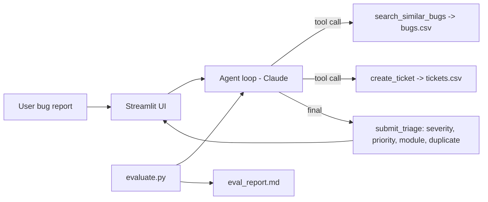

# AI Bug Triage Agent

Bug report (English/Hindi/Hinglish) -> agent severity, priority, module, duplicate check aur ticket banata hai.

## Run in VS Code (5 steps)
1. Folder VS Code mein kholo (File > Open Folder). Python 3.9+ chahiye.
2. Terminal kholo (Ctrl + `) aur virtual env banao:
   - Windows: `python -m venv venv` then `venv\Scripts\activate`
   - Mac/Linux: `python3 -m venv venv` then `source venv/bin/activate`
3. `pip install -r requirements.txt`
4. `.env.example` ko copy karke `.env` naam do, aur usme apni `ANTHROPIC_API_KEY` paste karo
   (key: https://console.anthropic.com)
5. `streamlit run app.py`  -> browser mein app khulega

## Accuracy report banane ke liye
`python evaluate.py`  -> `data/eval_report.md` aur `data/eval_results.csv` ban jayenge (app ke "Accuracy report" tab mein bhi dikhega)

## Files
| File | Kaam |
|---|---|
| `agent.py` | Agent loop + 3 tools (search_similar_bugs, create_ticket, submit_triage) |
| `app.py` | Streamlit UI |
| `evaluate.py` | 12 test bugs par accuracy nikalta hai |
| `data/bugs.csv` | 25 existing bugs (duplicate search ke liye) |
| `data/test_set.csv` | 12 test reports + expected answers |
| `data/tickets.csv` | Agent ke banaye tickets (auto create hota hai) |

## Architecture

(VS Code mein Mermaid dekhne ke liye "Markdown Preview Mermaid Support" extension install karo, ya https://mermaid.live par paste karo.)

## Demo video ke liye script
1. App kholo, "Duplicate example" chalao -> duplicate detect hona dikhao
2. "New bug example" chalao -> naya ticket bana, Tickets tab dikhao
3. "Agent ne kaunse tools use kiye" expander kholo
4. Accuracy report tab dikhao

## Aage badhane ke ideas
Existing bugs ko 100+ karo, keyword search ki jagah embeddings use karo, Jira API se asli ticket banao.
