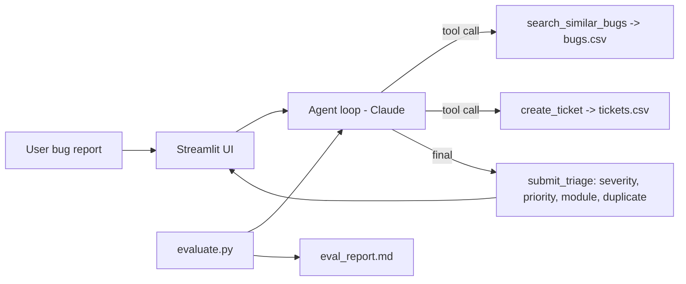

# AI Bug Triage Agent

Bug report (English/Hindi/Hinglish) -> agent severity, priority, module, duplicate check aur ticket banata hai.

## Run in VS Code (5 steps)
1. Folder VS Code mein kholo (File > Open Folder). Python 3.9+ chahiye.
2. Terminal kholo (Ctrl + `) aur virtual env banao:
   - Windows: `python -m venv venv` then `venv\Scripts\activate`
   - Mac/Linux: `python3 -m venv venv` then `source venv/bin/activate`
3. `pip install -r requirements.txt`
4. `.env.example` ko copy karke `.env` naam do, aur usme apni `ANTHROPIC_API_KEY` paste karo
   (key: https://console.anthropic.com)
5. `streamlit run app.py`  -> browser mein app khulega

## Accuracy report banane ke liye
`python evaluate.py`  -> `data/eval_report.md` aur `data/eval_results.csv` ban jayenge (app ke "Accuracy report" tab mein bhi dikhega)

## Files
| File | Kaam |
|---|---|
| `agent.py` | Agent loop + 3 tools (search_similar_bugs, create_ticket, submit_triage) |
| `app.py` | Streamlit UI |
| `evaluate.py` | 12 test bugs par accuracy nikalta hai |
| `data/bugs.csv` | 25 existing bugs (duplicate search ke liye) |
| `data/test_set.csv` | 12 test reports + expected answers |
| `data/tickets.csv` | Agent ke banaye tickets (auto create hota hai) |

## Architecture

(VS Code mein Mermaid dekhne ke liye "Markdown Preview Mermaid Support" extension install karo, ya https://mermaid.live par paste karo.)

## Demo video ke liye script
1. App kholo, "Duplicate example" chalao -> duplicate detect hona dikhao
2. "New bug example" chalao -> naya ticket bana, Tickets tab dikhao
3. "Agent ne kaunse tools use kiye" expander kholo
4. Accuracy report tab dikhao

## Aage badhane ke ideas
Existing bugs ko 100+ karo, keyword search ki jagah embeddings use karo, Jira API se asli ticket banao.
🚀 AI-Powered Bug Triage & Defect Classification Agent

The AI Bug Triage Agent is an intelligent Software Testing and QA automation project designed to simplify and automate the initial analysis of software defects. In a traditional QA workflow, testers manually review bug reports, determine severity and priority, identify the affected module, check for duplicate issues, and create tickets. This project uses an AI-powered agent workflow to automate these repetitive triage activities and provide structured, consistent results.

🔄 End-to-End Workflow

🐞 Bug Report
The tester enters a detailed bug description, including the observed issue and relevant application behavior. The system can handle bug reports written in English, Hindi, or Hinglish.

⬇️

🤖 AI Bug Analysis
The AI agent analyzes the reported issue and understands the nature of the defect.

⬇️

🔎 Similar Bug Search
The system searches the existing bug repository to identify similar or previously reported defects.

⬇️

🎯 Severity & Priority Classification
The agent determines the appropriate severity and priority based on the impact and urgency of the reported issue.

⬇️

🧩 Module Identification
The system identifies the application area affected by the defect, such as Login, Search, Cart, Checkout, Profile, Order Tracking, or General.

⬇️

♻️ Duplicate Detection
The reported issue is compared with existing defects to determine whether it is a new bug or a potential duplicate.

⬇️

🎫 Ticket Creation
The system generates a structured bug ticket containing the important triage information for further tracking.

📊 Interactive QA Dashboard

The project includes a Streamlit-based interactive interface where testers can submit bug reports and view the generated triage results. The dashboard makes it easier to understand the AI's decision, review tickets, and monitor the overall bug-triage workflow.

✨ Key Features

• 🤖 AI-powered automated bug triage
• 🐞 Software defect analysis
• 🎯 Severity and priority classification
• 🔎 Similar bug search
• ♻️ Duplicate bug detection
• 🧩 Application module identification
• 🎫 Automated bug-ticket generation
• 🌐 English, Hindi & Hinglish input support
• 📊 Interactive Streamlit dashboard
• 📈 Evaluation and accuracy reporting
• 📁 Structured bug repository and test dataset

🛠️ Technology Stack

Python | Streamlit | AI/LLM Agent | CSV Data | Agent Tools | GitHub

🧪 QA & Testing Concepts Demonstrated

This project demonstrates practical knowledge of Software Testing, Defect Management, Bug Reporting, Bug Triage, Severity & Priority, Duplicate Detection, Test Evaluation, Requirement Analysis, and QA Automation.

🎯 Project Objective

The primary objective is to demonstrate how Artificial Intelligence can be integrated into Software Testing workflows to reduce repetitive manual effort and improve the consistency of initial defect analysis.

🚀 Future Enhancements

The system can be further extended with a larger historical bug database, embedding-based semantic duplicate detection, real-time project integrations, Jira ticket creation, advanced analytics, and automated test-management workflows.

💡 Overall, this project combines AI, Software Testing, and Automation to demonstrate a practical approach toward building intelligent QA systems that can assist testers throughout the defect-management lifecycle.
